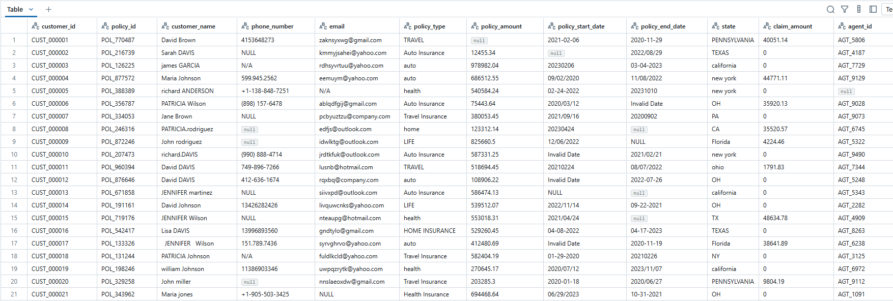
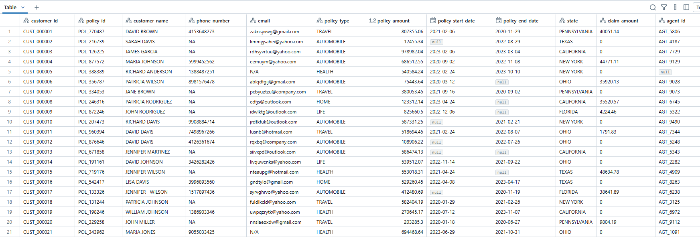

# 🚀 Project Overview

A comprehensive PySpark project for cleaning and transforming insurance policy data using both procedural and object-oriented approaches.

## 📋 Features

- **Dual Implementation Approaches**: Monolithic pipeline and modular class-based transformations
- **Comprehensive Data Cleaning**: Handles missing values, invalid formats, and inconsistent data
- **Data Standardization**: Normalizes various data formats and values
- **Performance Optimized**: Uses Spark's distributed computing capabilities
- **Configurable Parameters**: Easily adjustable regex patterns and default values

## 🛠️ Technologies Used

- **PySpark**: Python API for Spark
- **Python**: Core programming language

## 📊 Data Transformations

### Customer Data Cleaning
- **Customer Name**: Convert to uppercase, trim whitespace, remove special characters
- **Phone Number**: Standardize format, extract last 10 digits, handle NULL values
- **Email Validation**: Validate email formats using regex, replace invalid emails with "N/A"

### Policy Information Standardization
- **Policy Type**: Normalize policy categories (AUTOMOBILE, HEALTH, TRAVEL, HOME, LIFE)
- **Policy Amount**: Round to 2 decimal places, fill missing values with mean, filter negative values
- **Claim Amount**: Handle NULL and "N/A" values, set to 0 for missing claims

### Geographic Data Normalization
- **State Names**: Standardize state names and abbreviations
- **Supported States**: NY, PA, CA, IL, TX, OH, FL (others marked as "N/A")

### Date Processing
- **Multiple Date Formats**: Support for various date formats (yyyy-MM-dd, MM/dd/yyyy, etc.)
- **Invalid Date Handling**: Convert invalid dates to NULL
- **Date Columns**: Process both policy_start_date and policy_end_date

### Data Quality Measures
- **Missing Value Imputation**: Fill missing policy amounts with calculated mean
- **Data Type Validation**: Ensure proper data types for numerical fields
- **Outlier Handling**: Filter out negative policy amounts
---
## Transformed Data




#### Monolithic Approach
```python

email_regex = r"^[A-Za-z0-9._%+-]+@[A-Za-z0-9.-]+\.[A-Za-z]{2,}$"

mean = insurance.agg(sum("policy_amount")/count("policy_amount"))

mean_of_insurance = mean.select("(sum(policy_amount) / count(policy_amount))").collect()[0][0]

window_spec = Window.partitionBy("policy_id").orderBy("customer_id")


df_insurance = insurance.withColumn("customer_name", trim(upper(col("customer_name")))) \
                        .withColumn("customer_name", regexp_replace(col("customer_name"), r"[^a-zA-Z0-9]", " ")) \
                        .withColumn("phone_number", when(col("phone_number") == "NULL", "N/A").otherwise(col("phone_number"))) \
                        .fillna(value="N/A", subset=["phone_number"]) \
                        .withColumn("phone_number", regexp_replace(col("phone_number"), r"[^a-zA-Z0-9]", "")) \
                        .withColumn("phone_number", expr("substring(phone_number, length(phone_number) - 9, 10)")) \
                        .withColumn("email-validity", col("email").rlike(email_regex)) \
                        .withColumn("email", when(col("email-validity") == False, "N/A").otherwise(col("email"))) \
                        .fillna(value="N/A", subset=["email"]) \
                        .withColumn("policy_type", trim(col("policy_type"))) \
                        .withColumn("policy_amount", round(col("policy_amount"), 2)) \
                        .fillna(value=mean_of_insurance, subset=["policy_amount"]) \
                        .filter(col("policy_amount") >= 0) \
                        .withColumn("policy_amount", round(col("policy_amount"), 2)) \
                        .withColumn("claim_amount", when(col("claim_amount") == "NULL", 0).when(col("claim_amount") == "N/A", 0).otherwise(col("claim_amount"))) \
                        .withColumn("claim_amount", when(col("claim_amount").isNull(), 0).otherwise(col("claim_amount"))) \
                        .withColumn(
                                    "state",
                                     when(upper(col("state")).isin("NEW YORK", "NY"), "NEW YORK")
                                    .when(upper(col("state")).isin("PENNSYLVANIA", "PA"), "PENNSYLVANIA")
                                    .when(upper(col("state")).isin("CALIFORNIA", "CA"), "CALIFORNIA")
                                    .when(upper(col("state")).isin("ILLINOIS", "IL"), "ILLINOIS")
                                    .when(upper(col("state")).isin("TEXAS", "TX"), "TEXAS")
                                    .when(upper(col("state")).isin("OHIO", "OH"), "OHIO")
                                    .when(upper(col("state")).isin("FLORIDA", "FL"), "FLORIDA")
                                    .otherwise("N/A")) \
                        .withColumn("policy_start_date",
                                    when(col("policy_start_date").isNull() | 
                                        (col("policy_start_date") == "NULL") | 
                                        (col("policy_start_date") == "Invalid Date") |
                                        (col("policy_start_date") == ""), None)
                                    .otherwise(
                                        coalesce(
                                            to_date(col("policy_start_date"), "yyyy-MM-dd"),
                                            to_date(col("policy_start_date"), "MM/dd/yyyy"),
                                            to_date(col("policy_start_date"), "MM-dd-yyyy"),
                                            to_date(col("policy_start_date"), "dd-MM-yyyy"),
                                            to_date(col("policy_start_date"), "yyyy/MM/dd"),
                                            to_date(col("policy_start_date"), "yyyyMMdd"),
                                            lit(None)
                                        )
                                    )
                                ) \
                        .withColumn("policy_type",
                                    when(col("policy_type").isin("AUTOMOBILE", "Auto Insurance", "auto", "Auto Insurance"), "AUTOMOBILE")
                                    .when(col("policy_type").isin("HEALTH", "Health Insurance", "health"), "HEALTH")
                                    .when(col("policy_type").isin("TRAVEL", "Travel Insurance"), "TRAVEL")
                                    .when(col("policy_type").isin("HOME", "home", "Home Insurance", "HOME INSURANCE"), "HOME")
                                    .when(col("policy_type").isin("LIFE", "life", "Life Insurance", "life insurance"), "LIFE")

                                    .otherwise(col("policy_type"))
                                    ) \
                        .withColumn("policy_end_date",
                                    when(col("policy_end_date").isNull() | 
                                        (col("policy_end_date") == "NULL") | 
                                        (col("policy_end_date") == "Invalid Date") |
                                        (col("policy_end_date") == ""), None)
                                    .otherwise(
                                        coalesce(
                                            to_date(col("policy_end_date"), "yyyy-MM-dd"),
                                            to_date(col("policy_end_date"), "MM/dd/yyyy"),
                                            to_date(col("policy_end_date"), "MM-dd-yyyy"),
                                            to_date(col("policy_end_date"), "dd-MM-yyyy"),
                                            to_date(col("policy_end_date"), "yyyy/MM/dd"),
                                            to_date(col("policy_end_date"), "yyyyMMdd"),
                                            lit(None)
                                        )
                                    )
                                ) \
                        .drop(col("email-validity"))
df_insurance.cache()
df_insurance.createOrReplaceTempView("insurance_df")
df_insurance.display()

```

#### Modular Approach
```python
from pyspark.sql.window import Window

class InsuranceDataTransformer:
    def __init__(self, email_regex: str, mean_of_insurance: float):
        self.email_regex = email_regex
        self.mean_of_insurance = mean_of_insurance

    def clean_customer_name(self, df: DataFrame) -> DataFrame:
        return df.withColumn("customer_name", trim(upper(col("customer_name")))) \
                 .withColumn("customer_name", regexp_replace(col("customer_name"), r"[^a-zA-Z0-9]", " "))

    def clean_phone_number(self, df: DataFrame) -> DataFrame:
        return df.withColumn("phone_number", when(col("phone_number") == "NULL", "N/A").otherwise(col("phone_number"))) \
                 .fillna(value="N/A", subset=["phone_number"]) \
                 .withColumn("phone_number", regexp_replace(col("phone_number"), r"[^a-zA-Z0-9]", "")) \
                 .withColumn("phone_number", expr("substring(phone_number, length(phone_number) - 9, 10)"))

    def clean_email(self, df: DataFrame) -> DataFrame:
        return df.withColumn("email_valid", col("email").rlike(self.email_regex)) \
                 .withColumn("email", when(col("email_valid") == False, "N/A").otherwise(col("email"))) \
                 .fillna(value="N/A", subset=["email"]) \
                 .drop("email_valid")

    def clean_policy_type(self, df: DataFrame) -> DataFrame:
        return df.withColumn("policy_type", trim(col("policy_type"))) \
                 .withColumn("policy_type",
                             when(col("policy_type").isin("AUTOMOBILE", "Auto Insurance", "auto", "Auto Insurance"), "AUTOMOBILE")
                             .when(col("policy_type").isin("HEALTH", "Health Insurance", "health"), "HEALTH")
                             .when(col("policy_type").isin("TRAVEL", "Travel Insurance"), "TRAVEL")
                             .when(col("policy_type").isin("HOME", "home", "Home Insurance", "HOME INSURANCE"), "HOME")
                             .when(col("policy_type").isin("LIFE", "life", "Life Insurance", "life insurance"), "LIFE")
                             .otherwise(col("policy_type"))
                         )

    def clean_policy_amount(self, df: DataFrame) -> DataFrame:
        return df.withColumn("policy_amount", round(col("policy_amount"), 2)) \
                 .fillna(value=self.mean_of_insurance, subset=["policy_amount"]) \
                 .filter(col("policy_amount") >= 0) \
                 .withColumn("policy_amount", round(col("policy_amount"), 2))

    def clean_claim_amount(self, df: DataFrame) -> DataFrame:
        return df.withColumn("claim_amount", when(col("claim_amount").isin(["NULL", "N/A"]), 0)
                                               .otherwise(col("claim_amount"))) \
                 .withColumn("claim_amount", when(col("claim_amount").isNull(), 0)
                                               .otherwise(col("claim_amount")))

    def normalize_state(self, df: DataFrame) -> DataFrame:
        return df.withColumn(
            "state",
            when(upper(col("state")).isin("NEW YORK", "NY"), "NEW YORK")
            .when(upper(col("state")).isin("PENNSYLVANIA", "PA"), "PENNSYLVANIA")
            .when(upper(col("state")).isin("CALIFORNIA", "CA"), "CALIFORNIA")
            .when(upper(col("state")).isin("ILLINOIS", "IL"), "ILLINOIS")
            .when(upper(col("state")).isin("TEXAS", "TX"), "TEXAS")
            .when(upper(col("state")).isin("OHIO", "OH"), "OHIO")
            .when(upper(col("state")).isin("FLORIDA", "FL"), "FLORIDA")
            .otherwise("N/A")
        )

    def standardize_date(self, df: DataFrame, col_name: str) -> DataFrame:
        return df.withColumn(
            col_name,
            when(col(col_name).isNull() |
                 (col(col_name) == "NULL") |
                 (col(col_name) == "Invalid Date") |
                 (col(col_name) == ""), None)
            .otherwise(
                coalesce(
                    to_date(col(col_name), "yyyy-MM-dd"),
                    to_date(col(col_name), "MM/dd/yyyy"),
                    to_date(col(col_name), "MM-dd-yyyy"),
                    to_date(col(col_name), "dd-MM-yyyy"),
                    to_date(col(col_name), "yyyy/MM/dd"),
                    to_date(col(col_name), "yyyyMMdd"),
                    lit(None)
                )
            )
        )

    def transform(self, df: DataFrame) -> DataFrame:
        return (
            df.transform(self.clean_customer_name)
              .transform(self.clean_phone_number)
              .transform(self.clean_email)
              .transform(self.clean_policy_type)
              .transform(self.clean_policy_amount)
              .transform(self.clean_claim_amount)
              .transform(self.normalize_state)
              .transform(lambda d: self.standardize_date(d, "policy_start_date"))
              .transform(lambda d: self.standardize_date(d, "policy_end_date"))
        )
```
```python
email_regex = r"^[A-Za-z0-9._%+-]+@[A-Za-z0-9.-]+\.[A-Za-z]{2,}$"
mean = insurance.agg((sum("policy_amount") / count("policy_amount")).alias("mean_policy"))
mean_of_insurance = mean.collect()[0][0]

transformer = InsuranceDataTransformer(email_regex=email_regex, mean_of_insurance=mean_of_insurance)
df_transformed = transformer.transform(insurance)

df_transformed.cache()
df_transformed.display()

```

## Transformed Data




**Note**: This project is designed for demonstration purposes only 
